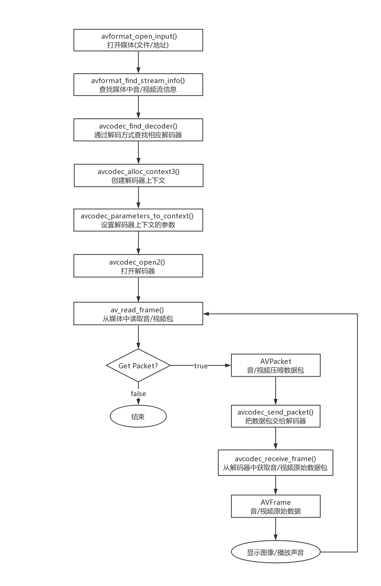
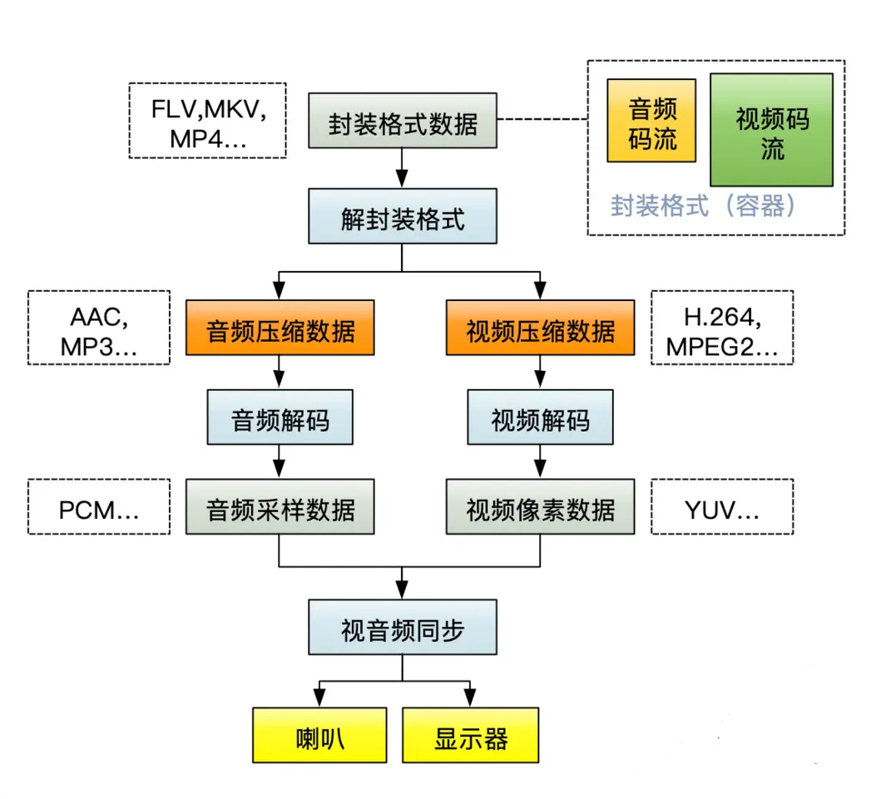

# zcwplayer

一款开源播放器，学习和实践

##视音频播放器流程概况

##视音频播放器流程概况

## 

## 代码逻辑功能：

1. EnjoyPlayer.cpp 控制主要逻辑实现

EnjoyPlayer 初始化av_formate_init
setDataSource
prepare
start
   ① - VideoChannel/AudioChannel::play
        - VideoChannel/AudioChannel::decode
        - VideoChannel/AudioChannel::_play
   ② - _start

2. VideoChannel.cpp 控制视频逻辑处理
① 
pthread,video_decode_t::decode()
    - avcodec_send_packet
    - avcodec_receive_frame
    - 插入frame_queue 队列
    
pthread,video_play_t::_play()
    - 格式转换sws_scale: sws_getContext 初始化
    - 准备格式转换接受数据申请空间：av_image_alloc
    - 按照行进行渲染格式转换：sws_scale 
    - 【音视频同步处理】
    - 读取 frame_queue 队列，出队列
    - 渲染数据：_onDraw
        - ANativeWindow_Buffer ----对应SurfaceView
        - ANativeWindow:memcpy 
stop

3. AudioChannel.cpp 音频处理
① 
pthread,audioDecode_t::decode()
    - avcodec_send_packet
    - avcodec_receive_frame
    - 插入frame_queue 队列

pthread,audioPlay_t::_play() 【使用OpenSL ES播放，不需要想audiochannel 通过JNI来回调用，直接播放】
    - OpenSL ES Android 播放7个步骤，swresample-ffmpeg 对音频重采样，音频数据转换
        - 1.创建引擎并获取引擎接口 
            1.1 SLresult<------slCreateEngine
                #include <SLES/OpenSLES.h>
                #include <SLES/OpenSLES_Android.h>
            1.2 初始化引擎，延时等待你创建成功
                result = (*engineObject)->Realize(engineObject, SL_BOOLEAN_FALSE);
            1.3 获取引擎接口engineInterface--->SLEngineItf
                result = (*engineObject)->GetInterface(engineObject,SL_IID_ENGINE, &engineInterface);
            - 2 创建混音器
            2.1 通过引擎接口，创建SLObjectItf<---CreateOutputMix混音器
                result = (*engineInterface)->CreateOutputMix(engineInterface, &outputMixObject, 0, 0, 0);
            2.2  初始化混音器outputMixObject
                result = (*outputMixObject)->Realize(outputMixObject, SL_BOOLEAN_FALSE);
        - 3 创建播放器
            3.1 创建buffer缓冲类型的队列作为数据定位器(获取播放数据) 2个缓冲区-SLDataLocator_AndroidSimpleBufferQueue
                SLDataLocator_AndroidSimpleBufferQueue android_queue ={SL_DATALOCATOR_ANDROIDSIMPLEBUFFERQUEUE, 2};
            3.2 pcm数据格式: pcm、声道数、采样率、采样位、容器大小、通道掩码(双声道)、字节序(小端)
                SLDataFormat_PCM pcm = {SL_DATAFORMAT_PCM, 2, SL_SAMPLINGRATE_44_1,
                                        SL_PCMSAMPLEFORMAT_FIXED_16,
                                        SL_PCMSAMPLEFORMAT_FIXED_16,
                                        SL_SPEAKER_FRONT_LEFT | SL_SPEAKER_FRONT_RIGHT,
                                        SL_BYTEORDER_LITTLEENDIAN};
            3.3 数据源 （数据获取器+格式）  从哪里获得播放数据
                SLDataSource slDataSource = {&android_queue, &pcm};
            3.4 设置混音器
                SLDataLocator_OutputMix outputMix = {SL_DATALOCATOR_OUTPUTMIX, outputMixObject};
                SLDataSink audioSnk = {&outputMix, NULL};
            3.5 需要的接口
                const SLInterfaceID ids[1] = {SL_IID_BUFFERQUEUE};
                const SLboolean req[1] = {SL_BOOLEAN_TRUE};
            3.6创建播放器
                (*engineInterface)->CreateAudioPlayer(engineInterface, &bqPlayerObject, &slDataSource,
                                                      &audioSnk, 1,
                                                      ids, req);
            3.7初始化播放器
                (*bqPlayerObject)->Realize(bqPlayerObject, SL_BOOLEAN_FALSE);
        - 4 播放
            4.1 获得播放数据队列操作接口
                (*bqPlayerObject)->GetInterface(bqPlayerObject, SL_IID_BUFFERQUEUE,
                                                &bqPlayerBufferQueue);
            4.2 设置回调(启动播放器后执行回调来获取数据并播放)
                (*bqPlayerBufferQueue)->RegisterCallback(bqPlayerBufferQueue, bqPlayerCallback, this);
                bqPlayerCallback 不断回调只要插入数据到缓冲去，后面自动调用，只要有数据就一直播放声音
                OpenGLEs----》Enqueue
                void bqPlayerCallback(SLAndroidSimpleBufferQueueItf queue, void *pContext) {
                    AudioChannel *audioChannel = static_cast<AudioChannel *>(pContext);
                    int dataSize = audioChannel->_getPCMData();
                    if (dataSize > 0) {
                        (*queue)->Enqueue(queue, audioChannel->buffer, dataSize);
                    }
                }
            4.3 获取播放状态接口
                (*bqPlayerObject)->GetInterface(bqPlayerObject, SL_IID_PLAY, &bqPlayerInterface);
            4.4 设置播放状态
                (*bqPlayerInterface)->SetPlayState(bqPlayerInterface, SL_PLAYSTATE_PLAYING);
            4.5 需要手动调用一次播放回调
                bqPlayerCallback(bqPlayerBufferQueue, this);
AudioChannel.cpp 初始化，声音三要素，转换AAC32bit --》 手机 16bit
    - 声道 av_get_channel_layout_nb_channels（ffmpeg）
    - 每个样本大小 av_get_bytes_per_sample 
    - 采样率 44100
    - 前三者相乘，结果==buffer开辟空间大小   说明上面步骤需要数据采样空间使用
stop

4. native内存优化和管理
EnjoyPlayer.cpp (解封装)
解封装：占用内存并不多，优化点不多
重量级：AVFrame -->1920 * 1080 * 4 

生产AVPacket 消费 AVPacket
如果生产过快，来不及消费AVPacket队列会很大占用，优化点1

AudioChannel.cpp (播放) 多线程，压缩包使用

VideoChannel.cpp (播放) 多线程，压缩包使用

JNICallbackHelper.cpp (管理回调)

native-lib.cpp (JNI函数管理)

## 涉及到的点：

1. 开启线程
    prepare 1个线程
    队列存放AVPacket 1个线程
    音频播放和解码 2个线程
    视频播放和解码 2个线程
2. 导入ffmpeg头文件，需要 c的方式 extern C
3. 将视频数据刷到buffer 的时候我们的数据是 RGBA * 4 
    但是ffmpeg 是 8位，所以我们需要字节对齐。 需要 除以 64 得到整数对齐
4. 生产者消费队列模型，编解码到播放需要用到线程交互模型和队列操作，数据加锁。
5. 开启权限 WRITE_EXTERNAL_STORAGE
6. 计算机原理，字节序（小端模式和大端模式），采用小端模式，传输过程必须另一端也是小端，保持一致
    如：int 4个字节到底是高位在前还是低位在前
7. 非专业人类，识别44100HZ 的声音。最高一般48000HZ，再高就浪费了
    16位，44100HZ（CD音质），48000HZ（DVD音质）
    ，8000HZ（电话音质 ），16000HZ(磁带录像机音质)，32000HZ(调频广播音质)
8. 音频三要素
    ① 采样率 44100等上面说的
    ② 位声/采样格式大小 16bit==2字节
    ③ 声道数 2（人类2个耳朵）
    音频压缩AAC，原始数据32bit，大部分44100，2个声道（32位计算用效率高，浮点运算，缺点：空间大。优点：内容更加丰富）
    手机格式，数据16bit，大部分44100，2个声道，目前显卡好的也要24bit，所以需要转换。
    通过三要素，（一帧音频的大小4096）
    一秒多少帧----> 1024 单通道样本数 计算：44100 / 1024 = 43.066(每秒 43帧)
    一秒音频大小---> 44100 * 2(采样2个字节) * 2(双通道) = 17400Byte
    一帧音频大小---> 1024 * 2 * 2 = 4096Byte
    一秒有多少帧---> 4096 * 43.066 = 176398.336 (大致判断1s 43帧音频左右)
9. FFmpeg 需要上下文 涉及 4个上下文：
    一，ffmpeg全局上下文。 AVFormatContext
    二，编解码上下文。 AVCodecContext
    三，视频上下文。SwsContext 
    四，音频上下文.SwrContext
10. 学习使用 FFmepg 拷贝代码
cd FFmpeg root-> resampling_audio.c 等 去main查看
11. 崩溃调试
Fatal signal 11 (SIGSEGV), code 1, fault addr 0x30 in tid 339
    -  data/tombstore_文件
        搜索关键信息，能够定位到函数。
    - adb 和 ndk 环境变量配置好
    adb logcat | ndk-stack-sym (cmake 下的libnative-lib.so 文件路径)
    `.../app/build/intermediates/cmake/debug/obj/armeabi-v7a/libnative-lib.so`
    必须先要运行一下，然后才能定位到
12. AV_DISPOSITION_ATTACHED_PIC 判断视频流，判断是封面跳过这一帧
    可以用ffmpeg检测